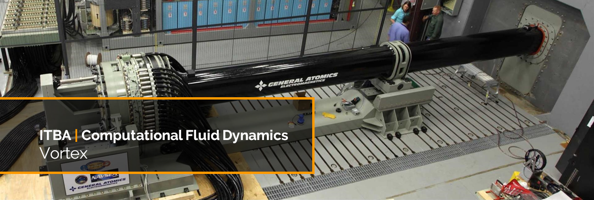

[](https://github.com/agustin-golmar/Vortex)
[](https://www.oracle.com/technetwork/java/javase/downloads/index.html)
[](https://fbinfer.com/)
[](https://www.travis-ci.com/agustin-golmar/Vortex)
[](https://snyk.io/test/github/agustin-golmar/Vortex?targetFile=pom.xml)
[](https://lgtm.com/projects/g/agustin-golmar/Vortex/alerts/)
[](https://app.fossa.com/projects/git%2Bgithub.com%2Fagustin-golmar%2FVortex?ref=badge_small)

# Vortex

An implementation of the _FHP model_ (with 6 velocity degrees of freedom),
based on _cellular automatons_, for the simulation of a 2D fluid. This model
can solve the _Navier-Stokes equation_ for an incompressible flow.

## Build

You need _Apache Maven +3.6.0_, and _Java SE +12 Release_. Then run:

```bash
$ mvn clean package
```

## Configuration

The configuration must be in a file named `vortex.json`, located in the root
folder. It must contain the following properties:

```
{
    "shape"         : "res/shape/barrier.shape",
    "output"        : "res/data/output",

    "lattice"       : [1920, 1080],
    "dimension"     : [1.0, 1.0],
    "steps"         : 100000,
    "window"        : 100,
    "average"       : 32,

    "contour"       : "non-periodic",
    "momentum"      : "left-to-right",
    "ratio"         : 0.1,

    "seed"          : 35265826342033,
    "workers"       : 0,
    "cuda"          : false,
    "saveAutomaton" : false
}
```

## Execution

In the root folder, just run:

```bash
$ java -jar vortex.jar
```

You can provide the following additional VM arguments:

* `log.level`: any level supported by _Logback_ (default is _INFO_).
* `log.timezone`: any timezone supported by _Logback_ (default is _America/Argentina/Buenos\_Aires_).

## License

[](https://app.fossa.io/projects/git%2Bgithub.com%2Fagustin-golmar%2FVortex?ref=badge_large)

## Designer

This project has been built, designed and maintained by:

* [Agustín Golmar](https://github.com/agustin-golmar)

## Bibliography

__"Title"__. Author. _Metadata. Date_.

__"Title"__. Author. _Access Date. [[https://github.com/agustin-golmar/Multitier]](https://github.com/agustin-golmar/Multitier)_

__"Introduction To Practice Of Molecular Simulation"__. Akira Satoh. _Elsevier
Inc. ISBN 978-0-12-385148-2. Akita Prefectural University, Japan. 2011_.

__"Lattice Boltzmann Modeling"__. Michael C. Sukop, Daniel T. Thorne Jr.
_Springer-Verlag Berlin Heidelberg. ISBN 978-3-540-27982-2. USA. 2006_.

__"Lattice-Gas Cellular Automata And Lattice Boltzmann Models - An
Introduction"__. Dieter A. Wolf-Gladrow. _Springer. Alfred Wegener Institute
for Polar and Marine, Germany. June 26, 2005_.

__"Cellular Automata As Models Of Complexity"__. Stephen Wolfram. _Nature,
Vol. 311, N° 5985. Macmillan Journals, 1985. The Institute For Advanced Study,
Princeton, New Jersey, USA. October 4, 1984_.
